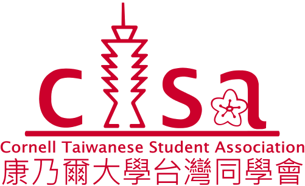

# Welcome to the Cornell Taiwanese Student Association (CTSA)!

## About Us

The Cornell Taiwanese Student Association (CTSA) is a non-profit, non-religious, and non-political organization dedicated to supporting Taiwanese students in adapting to life and academic studies within the Cornell community. Our primary mission is to facilitate the transition of Taiwanese students into Cornell University life. Additionally, we serve as a platform for building connections among students and communities. We warmly welcome anyone interested in Taiwanese culture to join our activities and learn more about this beautiful island.

## Friendships are Forged

Join us in exploring our vibrant community dedicated to promoting Taiwanese culture, fostering connections, and supporting Taiwanese students at Cornell.

We recognize the significance of academic success and are committed to providing resources and mentorship programs to aid Taiwanese students in their educational journey.

Feel free to reach out to us with any questions or inquiries. We look forward to having you as part of our community!

*Connect with us: [Facebook](https://www.facebook.com/groups/cornelltsa/)*

